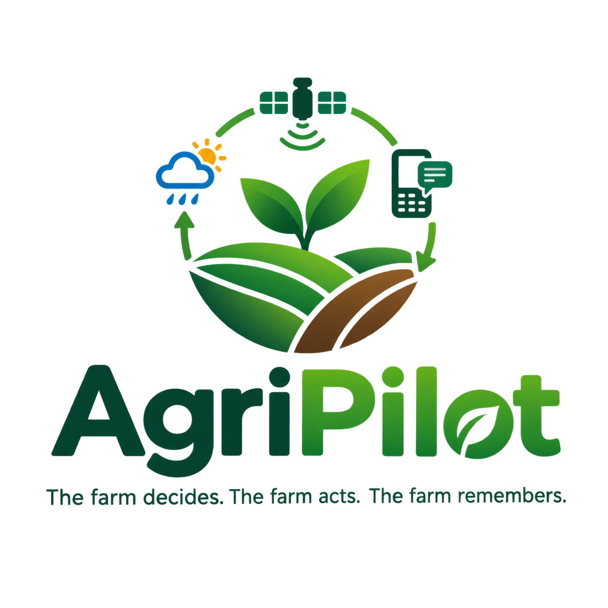
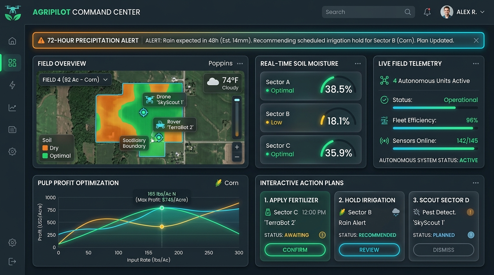
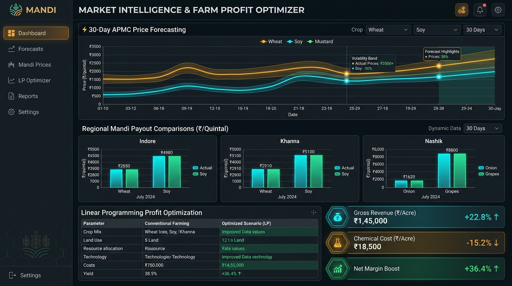
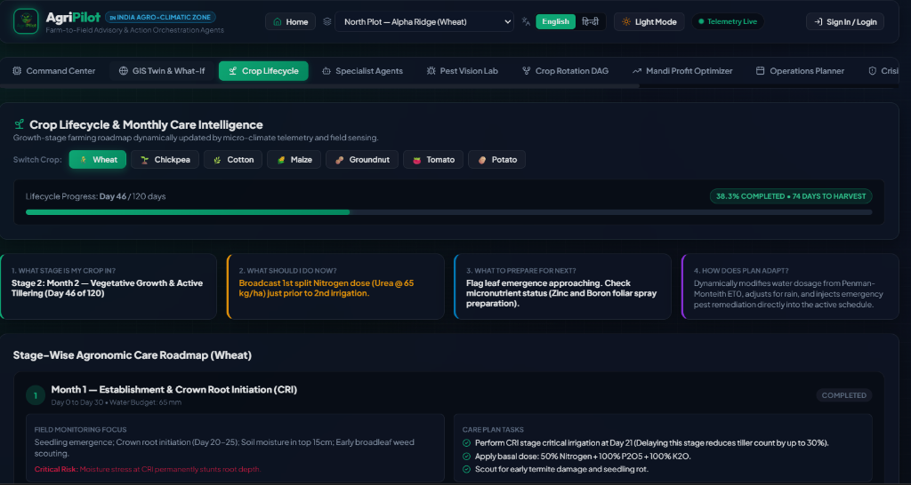
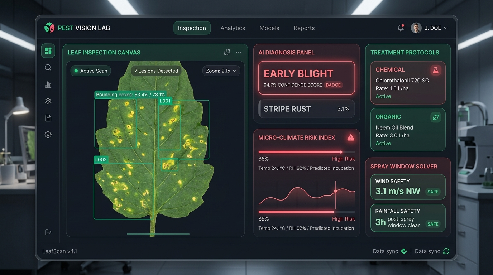
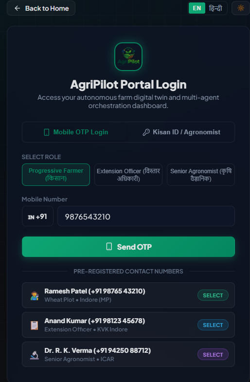

<p align="center">
  
</p>

# AgriPilot — Autonomous Farm Decision & Action Orchestration Platform

<p align="center"><i>The farm decides. The farm acts. The farm remembers.</i></p>

**A closed-loop, multi-agent decision system for precision farming — offline-first by design**

[](https://www.python.org/)
[](https://fastapi.tiangolo.com/)
[](https://react.dev/)
[](https://langchain-ai.github.io/langgraph/)
[](https://www.twilio.com/)
[](#license)
[](#contributing)

Built by **Team Tatva** for **Bit N Build '26** — *Problem Statement 6*

[Overview](#overview) • [The Gap](#the-gap-we-target) • [Features](#features) • [Product Screenshots](#product-screenshots) • [Architecture](#architecture) • [Decision Model](#decision-model) • [Getting Started](#getting-started) • [API Surface](#api-surface) • [Tech Stack](#tech-stack) • [Project Structure](#project-structure) • [Impact](#projected-impact) • [Roadmap](#roadmap) • [Team](#team-tatva)

---

## Overview

A smallholder farmer makes five decisions a week — irrigate or not, fertilise or not, spray or not, what to plant next, when to sell — and today each one is made in isolation, from habit, a regional forecast, and a guess.

The sensors, satellites, and price feeds that could inform those decisions already exist. What's missing is the layer above them: something that reconciles four incompatible data streams into *one* decision, and then carries that decision all the way to a valve opening or a phone ringing — including phones with no data connection.

**AgriPilot is that layer.** It senses the field, predicts risk, simulates the options against each other, schedules the resulting work, executes it — by MQTT relay, SMS, voice, or human escalation — and writes the outcome back into a seasonal memory so next season starts smarter than this one.

| Failure today | Root cause |
|---|---|
| Over-irrigation / under-irrigation | Regional forecasts miss field-level micro-climate |
| Fertiliser overuse & runoff | Soil feedback arrives late, via lab tests |
| Reactive, chemical-heavy pest control | Infestation spotted only once damage is visible |
| Harvested at the wrong time | Timing disconnected from mandi price and arrivals |
| Advice nobody acts on | Recommendations assume a smartphone and a data plan |

## The Gap We Target

Existing agri-tech isn't wrong — it's incomplete. IoT soil sensors, satellite imagery, weather APIs, and price feeds are all real and already deployed. What none of them do:

- **Reconcile** — a soil reading and a price forecast never talk to each other
- **Contextualize** — a moisture value is not a decision
- **Execute** — advice stops at a recommendation card; nobody opens the valve
- **Reach the offline farmer** — most tools assume bandwidth that rural users don't have

AgriPilot's contribution is the orchestration layer, not the sensing — every component in the stack below is proven, off-the-shelf technology.

## Features

- **Localized micro-climate forecasting** — Open-Meteo + field telemetry blended for field-level (not regional) weather and ET₀ estimates
- **Real-time soil intelligence** — automated NPK ratio and fertigation volume computation from live sensor readings
- **Dynamic crop rotation engine** — alternate-crop recommendations matched to soil health, water budget, and market demand
- **Vision-based pest detection** — leaf-level classification from drone/smartphone imagery for precision, early-stage treatment
- **Market-aware harvest timing** — price-forecast-informed harvest scheduling instead of calendar-only timing
- **Crop lifecycle intelligence** — growth-stage-wise care roadmaps that regenerate when the crop changes
- **Farm Digital Twin + what-if simulation** — every action is scored against its alternatives (e.g. irrigate-now vs. delay) on yield, cost, water, and risk *before* it's recommended
- **Adaptive agent marketplace** — specialist agents (weather, soil, crop, pest, market, machinery, labour) activated on demand and merged by one orchestration layer
- **Crisis & incident management** — abnormal field conditions become structured, tracked incidents with escalation paths
- **Autonomous operations planner** — the chosen action becomes a dated, resourced task, not just a suggestion
- **Farm-to-market coordination** — harvest, labour, logistics, and mandi timing aligned in one plan
- **Farm Memory & seasonal knowledge graph** — every outcome is logged, so advice gets farm-specific across seasons
- **Omnichannel, offline-first delivery** — MQTT to hardware, Twilio SMS/voice to feature phones, dashboard for extension workers, human agronomist escalation above a confidence threshold


## Product Screenshots

> A visual walkthrough of the AgriPilot prototype — from the autonomous decision cycle to market intelligence, crop care, pest detection, and farmer access.

### 1. Command Center — Closed-Loop Autonomous Decision Cycle

The Command Center brings field telemetry, specialist agents, risk detection, what-if analysis, operations planning, farm-to-market coordination, and execution into one closed loop.

<p align="center">
  
</p>

### 2. Mandi Profit Optimizer — Market-Aware Harvest Timing

The Mandi Profit Optimizer connects price forecasting with harvest decisions, helping the system reason about timing, expected price movement, and projected farm margin.

<p align="center">
  
</p>

### 3. Crop Lifecycle — Stage-Wise Agronomic Intelligence

The Crop Lifecycle module turns crop growth stages into an actionable care roadmap, including current crop stage, immediate actions, upcoming preparation, and dynamically adapting plans.

<p align="center">
  
</p>

### 4. Pest Vision Lab — Vision-Based Early Detection & Spray Solver

The Pest Vision Lab combines leaf-image detection with micro-climate and application-safety constraints to identify risk and determine whether conditions are suitable for intervention.

<p align="center">
  
</p>

### 5. Farmer & Agronomist Access — Role-Based Login

The portal supports different users, including progressive farmers, extension officers, and senior agronomists, with mobile OTP and Kisan ID/Agronomist access flows.

<p align="center">
  
</p>

## Architecture

```
 IoT Soil Telemetry ─┐
 Open-Meteo Weather  ─┤
 Drone / Phone Imagery┼──▶  Risk Detection Agent  ──▶  Farm Digital Twin
 Mandi Price APIs    ─┘            │                    (what-if simulation)
                                    ▼                          │
                        Specialist Agent Marketplace           ▼
                (weather · soil · crop · pest · market   Constraint Solver
                     · machinery · labour)             (cost, labour, water,
                                    │                   crop safety, weather)
                                    ▼                          │
                     Autonomous Operations Planner ◀───────────┘
                                    │
                                    ▼
                  Execution Orchestration Agent
                  ┌─────────────┬──────────────┬──────────────────┐
                  ▼             ▼              ▼                  ▼
             MQTT Relay    Twilio SMS/Voice   Dashboard      Human Agronomist
             (irrigation)  (offline farmer)  (extension)      (escalation)
                                    │
                                    ▼
              Farm Memory & Seasonal Knowledge Graph ──▶ (feeds next cycle)
```

### The closed-loop decision cycle

The full cycle re-runs continuously as new telemetry, weather, and market data arrive:

```
Sense ──▶ Predict ──▶ Optimize ──▶ Coordinate ──▶ Execute ──▶ Monitor ──┐
  ▲                                                                     │
  └───────────────────────  fed into next cycle  ────────────────────  ┘
```

**Worked example:** Heavy rain is forecast in 24 hours → the Digital Twin simulates *irrigate-now* against *delay* → delay wins on water saved with no added crop stress → the planner reschedules the irrigation slot → an SMS goes to the farmer → the outcome is written to Farm Memory so the system remembers this field drains slowly.

## Decision Model

Every action AgriPilot recommends clears a multi-constraint solver before it is approved — it isn't a single prediction, it's a scored comparison across the field's real constraints:

```
minimize    input_cost + water_used + crop_stress_risk

subject to  soil_moisture           ≥  crop_safety_floor
            fertigation_volume      ≤  NPK-derived_max_dose
            labour_and_machinery    ≤  available_capacity
            action_window           ⊆  suitable_weather_window
            pesticide_application   respects  pre-harvest_interval (PHI)
```

Recommendations above a confidence threshold execute automatically (MQTT / SMS); recommendations below it escalate to a human agronomist rather than auto-executing.

## Getting Started

> AgriPilot is built around this stack for the hackathon prototype. Component-level completeness is tracked in [Roadmap](#roadmap) — see that section for exactly what runs end-to-end today versus what is designed but not yet wired up.

### Prerequisites

- Python 3.12+
- Node.js 18+
- (Optional) an [Open-Meteo](https://open-meteo.com/) API key and Twilio credentials for live weather and SMS

### Backend

```bash
cd backend
pip install -r requirements.txt
uvicorn app.main:app --reload
```

Interactive API docs are served at `http://localhost:8000/docs`.

### Frontend

```bash
cd frontend
npm install
npm run dev
```

Dashboard runs at `http://localhost:5173`.

### Environment variables (optional)

```bash
# backend/.env
OPEN_METEO_API_KEY=your_key_here
TWILIO_ACCOUNT_SID=your_sid_here
TWILIO_AUTH_TOKEN=your_token_here
MANDI_PRICE_API_KEY=your_key_here
```

Without these, the backend falls back to synthetic weather/price data and disables live SMS delivery — the app still runs end-to-end for the demo.

## API Surface

Planned/implemented endpoint surface for the orchestration layer — see [`/docs`](http://localhost:8000/docs) once the backend is running for the authoritative, live schema.

| Method | Endpoint | Description |
|---|---|---|
| `GET` | `/api/field/{id}/twin` | Farm Digital Twin state for a field |
| `POST` | `/api/simulate` | Run a what-if comparison (e.g. irrigate-now vs. delay) |
| `GET` | `/api/forecast/microclimate` | Field-level weather & ET₀ forecast |
| `GET` | `/api/soil/{id}` | Live NPK, pH, moisture, EC readings |
| `POST` | `/api/pest/classify` | Submit leaf imagery for pest/disease classification |
| `GET` | `/api/market/forecast` | Mandi price forecast for harvest timing |
| `POST` | `/api/plan/optimize` | Run the constraint solver and return a scored action plan |
| `GET` | `/api/incidents` | Active crisis/incident queue |
| `POST` | `/api/dispatch/{action}` | Trigger MQTT relay / SMS / voice / agronomist escalation |
| `GET` | `/api/memory/{field_id}` | Seasonal knowledge graph for a field |

## Tech Stack

| Layer | Technology |
|---|---|
| Agent orchestration | LangChain / LangGraph, OpenAI GPT-4o |
| Computer vision | YOLOv8 (leaf-level pest/disease classification) |
| Backend services | Python 3.12, FastAPI, Celery, Redis |
| Data — spatial | PostgreSQL + PostGIS (field geometry) |
| Data — time-series | TimescaleDB (sensor telemetry) |
| Data — logs | MongoDB (advisory & incident logs) |
| Frontend | React / Next.js, TailwindCSS |
| Field execution | MQTT (irrigation relays), Twilio (SMS / voice) |
| Weather & market data | Open-Meteo API, government mandi price APIs |

## Project Structure

```
AgriPilot/
├── backend/
│   ├── requirements.txt
│   └── app/
│       ├── main.py                    # FastAPI entrypoint
│       ├── agents/
│       │   ├── risk_detection/        # Crisis & anomaly detection
│       │   ├── action_planning/       # Constraint solver + operations planner
│       │   └── execution/             # MQTT / Twilio / escalation orchestration
│       ├── digital_twin/              # Farm Digital Twin + what-if simulation
│       ├── marketplace/               # Specialist agents (weather, soil, crop, pest, market...)
│       ├── lifecycle/                 # Crop lifecycle & monthly care intelligence
│       ├── farm_to_market/            # Harvest, labour, logistics coordination
│       ├── memory/                    # Seasonal knowledge graph
│       ├── models/                    # SQLAlchemy + Pydantic schemas
│       └── routers/                   # API route handlers
└── frontend/
    ├── package.json
    └── src/
        ├── pages/                     # Field map, lifecycle roadmap, what-if, incidents, ops
        ├── components/                # Charts, heatmaps, gauges, alert cards
        └── utils/, hooks/             # API client, auth, data hooks
```

## Projected Impact

> These are design targets from our expected-outcomes analysis, **not measured results** — we have not yet run a field trial. We're presenting the hypothesis and the plan to test it, not evidence.

| Metric | Target | Mechanism |
|---|---|---|
| Fertiliser applied | ↓ 25–30% | Precision fertigation replaces static dosing |
| Freshwater consumed | ↓ up to 35% | Micro-climate forecasting prevents unnecessary irrigation |
| Input cost / hectare | ↓ $150–250 | Targeted fertigation + localised pest containment |
| Net farm income | ↑ 20–35% | Market-aware harvest timing + optimal crop selection |

**Validation plan:** bench-test the pest CV model against PlantVillage and the ET₀ model against historical Open-Meteo + held-out farm station data (weeks 0–4) → paired-plot field pilot for one season, measuring water/fertiliser/pesticide use, yield, and realised price against a conventionally-farmed control plot → continuous tracking of SMS delivery, advisory adoption rate, and escalation precision.

## Roadmap

- [ ] Closed-loop cycle running end-to-end on one field, one crop, with the SMS path live *(hackathon build target)*
- [ ] Benchmark vision & forecast models on public datasets; multi-field, multi-crop support
- [ ] Local-language SMS/voice templates
- [ ] Paired-plot field pilot for one season against conventional practice
- [ ] Cooperative-scale deployment — one instance serving hundreds of holdings
- [ ] Extension-worker triage dashboard with prioritized field risk queue

**Out of scope (by design):** fabricating custom IoT/drone hardware (standard REST/MQTT telemetry assumed), executing commodity trades or loan settlement, and regulatory certification for autonomous pesticide drone spraying.

## Contributing

Contributions are welcome. Please open an issue to discuss significant changes before submitting a pull request.

1. Fork the repository
2. Create a feature branch (`git checkout -b feature/your-feature`)
3. Commit your changes
4. Open a pull request

## Team Tatva

| Area | Scope |
|---|---|
| Core Backend & Orchestration | Multi-agent coordination, constraint solver, execution & escalation |
| Digital Twin & Simulation | What-if engine, farm profit optimization, autonomous operations planner |
| Forecasting & Vision | Micro-climate/ET₀ forecasting, soil intelligence, pest CV pipeline |
| Frontend Dashboard | Field maps, lifecycle roadmap, incident & ops views |

## License

Distributed under the MIT License. See `LICENSE` for details.

---

<p align="center"><i>The data reached the field years ago. The decision never did.</i></p>
